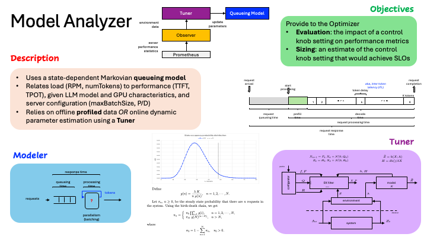

# Analysis of queueing systems and networks

This repository contains models of various queueing systems and networks.

In particular, a [state-dependent Markovian queue](pkg/queue/mm1modelstatedependent.go) is used to model an [LLM inference server](demos/mm1state/main.go), serving requests with multiple tokens.

For ease of use and deployment, a [REST server](pkg/service/analyzer.go) is provided.

## Data specification

Input to the server is a problem statement and output is the analysis solution. The input and output json formats are shown below.

``` go
// problem input data
type ProblemData struct {
 RPM          float32 `json:"RPM"`          // request arrival rate (requests/min)
 MaxBatchSize int     `json:"maxBatchSize"` // maximum batch size
 AvgNumTokens int     `json:"avgNumTokens"` // average number of tokens per request
 Alpha        float32 `json:"alpha"`        // tau(n) = alpha + n * beta (msec)
 Beta         float32 `json:"beta"`         // tau(n) = alpha + n * beta (msec)
 MaxQueueSize int     `json:"maxQueueSize"` // maximum queue size
 TargetWait   float32 `json:"targetWait"`   // target queueing time (sec)
 TargetITL    float32 `json:"targetITL"`    // target inter-token interval (msec)
}
```

``` go
// analysis solution output data
type AnalysisData struct {
 Throughput    float32 `json:"throughput"`    // effective throughput (requests/min)
 AvgRespTime   float32 `json:"avgRespTime"`   // average response time (sec)
 AvgWaitTime   float32 `json:"avgWaitTime"`   // average queueing time (sec)
 AvgNumInServ  float32 `json:"avgNumInServ"`  // average number of requests in system
 AvgTokenTime  float32 `json:"avgTokenTime"`  // average token time (msec)
 MaxRPM        float32 `json:"maxRPM"`        // maximum throughput (requests/min)
 RMPTargetWait float32 `json:"RMPTargetWait"` // RPM for target queueing time (requests/min)
 RPMTargetITL  float32 `json:"RPMTargetITL"`  // RPM for target ITL (requests/min)
}
```

## Endpoints

There are two operations:

1. **\solve**

    Analyze the queue given a set of parameters, namely: RPM, maxBatchSize, avgNumTokens, alpha, beta, and maxQueueSize.

    ``` json
    {
    "RPM": 30,
    "maxBatchSize": 48,
    "avgNumTokens": 1024,
    "alpha": 19,
    "beta": 1,
    "maxQueueSize": 200
    }
    ```

    The results of the analysis are: throughput, avgRespTime, avgWaitTime, avgNumInServ, avgTokenTime, and maxRPM.

    ``` json
    {
    "throughput": 29.999998,
    "avgRespTime": 41.96881,
    "avgWaitTime": 0.0027617188,
    "avgNumInServ": 20.983025,
    "avgTokenTime": 40.98247,
    "maxRPM": 41.93564,
    "RMPTargetWait": 0,
    "RPMTargetITL": 0
    }
    ```

2. **\target**

    Find the maximum arrival rate which yields at most the specified target performance values for the waiting time and the inter-token latency (ITL).

    ``` json
    {
    "maxBatchSize": 48,
    "avgNumTokens": 1024,
    "alpha": 19,
    "beta": 1,
    "maxQueueSize": 200,
    "targetWait": 1.0,
    "targetITL": 50.0
    }
    ```

    The corresponding queue metrics for such arrival rate are provided in the output.

    ``` json
    {
    "throughput": 35.200314,
    "avgRespTime": 51.532883,
    "avgWaitTime": 0.33288673,
    "avgNumInServ": 30.037598,
    "avgTokenTime": 49.999996,
    "maxRPM": 41.93564,
    "RMPTargetWait": 36.61307,
    "RPMTargetITL": 35.200314
    }
    ```

## Installation

The server may run in the following ways.

- Locally
  
    Launch [main.go](./main.go):

    ``` bash
    go run main.go
    ```

- Docker

    Build and run the image:

    ``` bash
    docker build -t queue .
    docker run -d -p 8080:8080 --name queue queue
    ```

    To stop and remove the container after usage:

    ``` bash
    docker stop queue
    docker rm queue
    ```

- Kubernetes cluster

    Create the pod and forward the service port:

    ``` bash
    kubectl create -f yamls/pod.yaml
    kubectl port-forward queue 8080:8080
    ```

    To delete the pod after usage:

    ``` bash
    kubectl delete -f yamls/pod.yaml
    ```

## Usage

Then, the server may be invoked as follows.

- Using json files

``` bash
curl -X POST http://localhost:8080/solve -d @<problem-data-json-file>

curl -X POST http://localhost:8080/target -d @<problem-data-json-file>
```

- Data in command line

``` json
curl -X POST http://localhost:8080/solve \
  --header "Content-Type: application/json" \
  --data '{"alpha": 8.0, "beta": 0.06, "maxBatchSize": 512, "maxQueueSize": 1000, "avgNumTokens": 494, "RPM": 276}'

curl -X POST http://localhost:8080/target \
  --header "Content-Type: application/json" \
  --data '{"alpha": 8.0, "beta": 0.06, "maxBatchSize": 512, "maxQueueSize": 1000, "avgNumTokens": 494, "targetWait": 1000, "targetITL": 10}'
```

## Description

The model analyzer maintains an analytical performance model for each variant (server) in the system. Such a performance model captures the statistical behavior of requests as they pass through a server, including queueing and processing times, as a function load characteristics, such as request rates and sizes (input and output tokens), and server characteristics such as GPU type and configuration (P/D disaggregation, chunked prefill, etc). The performance model may be based on queueing theory, machine learning techniques, or other mechanisms.



The purpose of using a performance model is twofold.

- Performance evaluation: Estimate performance metrics such as waiting time, TTFT, ITL, and TPOT, as a function of a given load and server characteristics.

- Target sizing: Determine load and/or server characteristics in order to attain target values of performance metrics.
The former is used to estimate performance given the current and/or predicted/anticipated environment. Whereas, the latter is mainly used by the Optimizer to assess maximum request rate to guarantee given SLOs, as well as the impact of a choice of a particular GPU type.

Typically, analytical performance models have their own internal parameters. For example, a model might approximate ITL, as a function of the batch size, by a linear function. The base and slope of the linear function are parameters of the model. In this case, the determination of such parameters may be achieved through offline benchmarking and/or online through observations and tuning (dynamic adjustment of parameter values to match observations).
