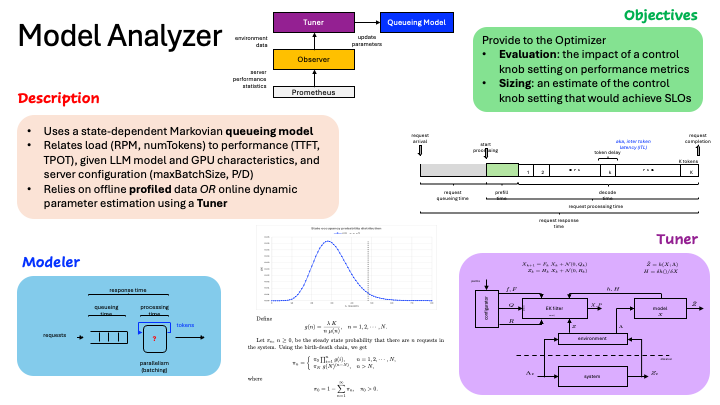

# Analysis of queueing systems and networks

This repository contains models of various queueing systems and networks.

In particular, a [state-dependent Markovian queue](pkg/queue/mm1modelstatedependent.go) is used to model an [LLM inference server](demos/mm1state/main.go), serving requests with multiple tokens.

For ease of use and deployment, a [REST server](pkg/service/analyzer.go) is provided.

## Data specification

Input to the server is a problem statement and output is the analysis solution. The input and output json formats are shown below.

``` go
// problem input data
type ProblemData struct {
 RPS             float32 `json:"RPS"`             // request arrival rate (requests/sec)
 MaxBatchSize    int     `json:"maxBatchSize"`    // maximum batch size
 AvgInputTokens  float32 `json:"avgInputTokens"`  // average number of input tokens per request
 AvgOutputTokens float32 `json:"avgOutputTokens"` // average number of output tokens per request
 Alpha           float32 `json:"alpha"`           // base iteration time (msec)
 Beta            float32 `json:"beta"`            // slope for compute time (msec/token)
 Gamma           float32 `json:"gamma"`           // slope for memory access time (msec/token*2)
 MaxQueueSize    int     `json:"maxQueueSize"`    // maximum queue size
 TargetTTFT      float32 `json:"targetTTFT"`      // target time to first token (msec)
 TargetITL       float32 `json:"targetITL"`       // target inter-token interval (msec)
}
```

``` go
// analysis solution output data
type AnalysisData struct {
 Throughput    float32 `json:"throughput"`    // effective throughput (requests/sec)
 AvgRespTime   float32 `json:"avgRespTime"`   // average response time (sec)
 AvgWaitTime   float32 `json:"avgWaitTime"`   // average queueing time (sec)
 AvgNumInServ  float32 `json:"avgNumInServ"`  // average number of requests in system
 AvgTTFT       float32 `json:"avgTTFT"`       // average time to first token (msec)
 AvgITL        float32 `json:"avgITL"`        // average inter-token latency (msec)
 MaxRPS        float32 `json:"maxRPS"`        // maximum throughput (requests/sec)
 RPSTargetTTFT float32 `json:"RPSTargetTTFT"` // throughput to achieve target TTFT (requests/sec)
 RPSTargetITL  float32 `json:"RPSTargetITL"`  // throughput to achieve target ITL (requests/sec)
}
```

``` go
// optimal-concurrency output data (POST /optimize)
type OptimizeData struct {
 Concurrency  int     `json:"concurrency"`  // minimum concurrency (max batch size) for near-peak throughput under SLO
 Throughput   float32 `json:"throughput"`   // throughput at the chosen concurrency (requests/sec)
 AvgRespTime  float32 `json:"avgRespTime"`  // average response time (msec)
 AvgWaitTime  float32 `json:"avgWaitTime"`  // average queueing time (msec)
 AvgNumInServ float32 `json:"avgNumInServ"` // average number of requests in service
 AvgTTFT      float32 `json:"avgTTFT"`      // average time to first token (msec)
 AvgITL       float32 `json:"avgITL"`       // average inter-token latency (msec)
 MaxRPS       float32 `json:"maxRPS"`       // maximum throughput (requests/sec)
 MITL         int     `json:"M_ITL"`        // closed-form ITL-binding batch size
 MTPF         int     `json:"M_TPF"`        // closed-form TTFT-prefill-binding batch size
 Calls        int     `json:"oracleCalls"`  // number of model evaluations used by the search
 Feasible     bool    `json:"feasible"`     // whether the SLO is achievable within [1, maxBatchSize]
}
```

## Endpoints

There are three operations:

1. **\solve**

    Analyze the queue given a set of parameters, namely: RPS, maxBatchSize, alpha, beta, gamma, and maxQueueSize.

    ``` json
    {
    "RPS": 3.0,
    "maxBatchSize": 48,
    "AvgInputTokens": 128,
    "AvgOutputTokens": 512,
    "alpha": 12,
    "beta": 0.05,
    "gamma": 0.0005,
    "maxQueueSize": 128
    }
    ```

    The results of the analysis are: throughput, avgRespTime, avgWaitTime, avgNumInServ, avgTTFT, avgITL, and maxRPS.

    ``` json
    {
    "throughput": 3,
    "avgRespTime": 10568.446,
    "avgWaitTime": 28.27539,
    "avgNumInServ": 31.620514,
    "avgTTFT": 75.31746,
    "avgITL": 20.534498,
    "maxRPS": 3.8208232
    }
    ```

2. **\target**

    Find the maximum arrival rate which yields at most the specified target performance values for TTFT and ITL.

    ``` json
    {
    "RPS": 3.0,
    "maxBatchSize": 48,
    "AvgInputTokens": 128,
    "AvgOutputTokens": 512,
    "alpha": 12,
    "beta": 0.05,
    "gamma": 0.0005,
    "maxQueueSize": 128,
    "targetTTFT": 60.0,
    "targetITL": 20.0
    }
    ```

    The corresponding queue metrics for such arrival rate are provided in the output.

    ``` json
    {
    "throughput": 2.8741095,
    "avgRespTime": 10276.054,
    "avgWaitTime": 10.09375,
    "avgNumInServ": 29.505493,
    "avgTTFT": 56.063286,
    "avgITL": 19.99998,
    "maxRPS": 3.8208232,
    "RPSTargetTTFT": 2.910594,
    "RPSTargetITL": 2.8741095
    }
    ```

3. **\optimize**

    Find the minimum request concurrency (max batch size) that achieves near-maximum request throughput while still meeting the target performance values for TTFT and ITL. Here `maxBatchSize` is interpreted as the search upper bound (the largest concurrency to consider); the returned `concurrency` is the smallest batch-size limit that reaches near-peak throughput under the SLO. Operating below it sacrifices throughput, while operating above it over-provisions concurrency and reduces robustness to traffic surges.

    Because `maxBatchSize` is the search ceiling, give `/optimize` a generous value (e.g. 256 below) rather than a tight production batch cap — if the ceiling is set near the true optimum, the search has no room to descend and `concurrency` simply pins to `maxBatchSize`. (This is why reusing the shared `examples/problem-data.json`, whose `maxBatchSize` is 48, yields `concurrency: 48` in `examples/solution-optimize.json`: 48 is the ceiling, not a discovered optimum.)

    ``` json
    {
    "maxBatchSize": 256,
    "AvgInputTokens": 128,
    "AvgOutputTokens": 512,
    "alpha": 12,
    "beta": 0.05,
    "gamma": 0.0005,
    "maxQueueSize": 128,
    "targetTTFT": 60.0,
    "targetITL": 20.0
    }
    ```

    The output reports the chosen `concurrency` (the optimal max batch size), the queue metrics at that operating point, the closed-form brackets `M_ITL` / `M_TPF` that guide the search, and the number of `oracleCalls` (model evaluations) the search needed. Note how the chosen concurrency (49) sits well below the search ceiling (256): only 49 concurrent requests are needed to reach near-peak throughput within the SLO.

    ``` json
    {
    "concurrency": 49,
    "throughput": 2.9715836,
    "avgRespTime": 10277.985,
    "avgWaitTime": 12.017578,
    "avgNumInServ": 30.50618,
    "avgTTFT": 57.9873,
    "avgITL": 19.999996,
    "maxRPS": 3.9003835,
    "M_ITL": 31,
    "M_TPF": 164,
    "oracleCalls": 8,
    "feasible": true
    }
    ```

## Installation

The server may run in the following ways.

- Locally
  
    Launch [main.go](./main.go):

    ``` bash
    go run main.go
    ```

- Docker

    Build and run the image:

    ``` bash
    docker build -t queue-analyzer .
    docker run -d -p 8080:8080 --name queue-analyzer queue-analyzer
    ```

    To stop and remove the container after usage:

    ``` bash
    docker stop queue-analyzer
    docker rm queue-analyzer
    ```

- Kubernetes cluster

    Create the pod and forward the service port:

    ``` bash
    kubectl create -f yamls/pod.yaml
    kubectl port-forward queue-analyzer 8080:8080
    ```

    To delete the pod after usage:

    ``` bash
    kubectl delete -f yamls/pod.yaml
    ```

## Usage

Then, the server may be invoked as follows.

- Using json files

``` bash
curl -X POST http://localhost:8080/solve -d @<problem-data-json-file>

curl -X POST http://localhost:8080/target -d @<problem-data-json-file>

curl -X POST http://localhost:8080/optimize -d @<problem-data-json-file>
```

- Data in command line

``` json
curl -X POST http://localhost:8080/solve \
  --header "Content-Type: application/json" \
  --data '{"alpha": 8.0, "beta": 0.1, "maxBatchSize": 24, "maxQueueSize": 1000, "avgInputTokens": 256, "avgOutputTokens": 512, "RPS": 2.4}' | jq

curl -X POST http://localhost:8080/target \
  --header "Content-Type: application/json" \
  --data '{"alpha": 8.0, "beta": 0.1, "maxBatchSize": 24, "maxQueueSize": 1000, "avgInputTokens": 256, "avgOutputTokens": 512, "targetTTFT": 45, "targetITL": 12}' | jq

curl -X POST http://localhost:8080/optimize \
  --header "Content-Type: application/json" \
  --data '{"alpha": 8.0, "beta": 0.1, "maxBatchSize": 256, "maxQueueSize": 1000, "avgInputTokens": 256, "avgOutputTokens": 512, "targetTTFT": 45, "targetITL": 12}' | jq
```

## Description

The model analyzer maintains an analytical performance model for each variant (server) in the system. Such a performance model captures the statistical behavior of requests as they pass through a server, including queueing and processing times, as a function load characteristics, such as request rates and sizes (input and output tokens), and server characteristics such as GPU type and configuration (P/D disaggregation, chunked prefill, etc). The performance model may be based on queueing theory, machine learning techniques, or other mechanisms.



The purpose of using a performance model is threefold.

- Performance evaluation: Estimate performance metrics such as waiting time, TTFT, ITL, and TPOT, as a function of a given load and server characteristics.

- Target sizing: Determine load and/or server characteristics in order to attain target values of performance metrics.

- Concurrency optimization: Determine the minimum concurrency (max batch size) that reaches near-peak throughput while honoring the SLOs, so the server runs neither under-batched (sacrificing throughput) nor over-provisioned (fragile to traffic surges).

The first is used to estimate performance given the current and/or predicted/anticipated environment. The second is mainly used by the Optimizer to assess maximum request rate to guarantee given SLOs, as well as the impact of a choice of a particular GPU type. The third is used by the Optimizer to set the concurrency level of a server, and by the control loop to demonstrate the value of concurrency control.

Typically, analytical performance models have their own internal parameters. For example, a model might approximate ITL, as a function of the batch size, by a linear function. The base and slope of the linear function are parameters of the model. In this case, the determination of such parameters may be achieved through offline benchmarking and/or online through observations and tuning (dynamic adjustment of parameter values to match observations).
